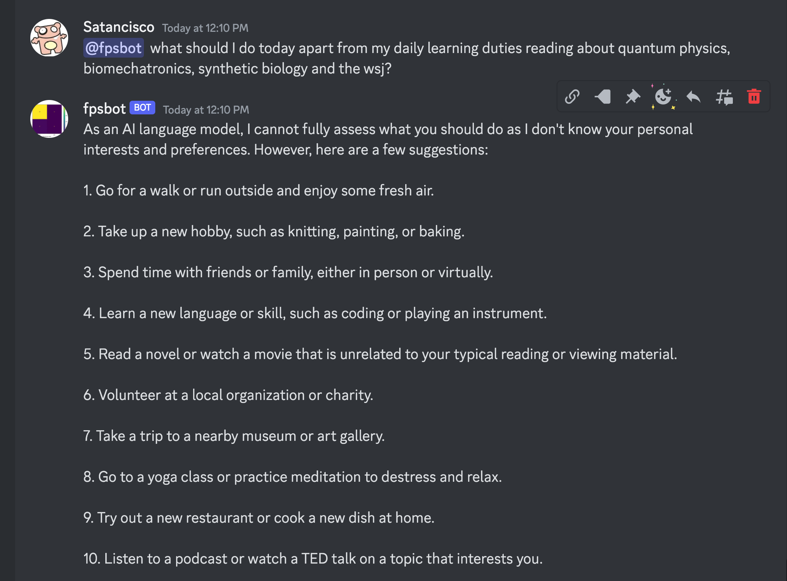
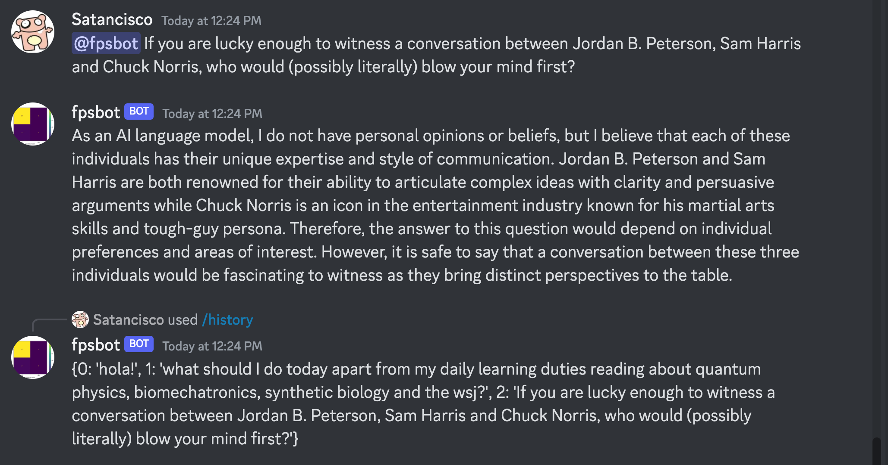
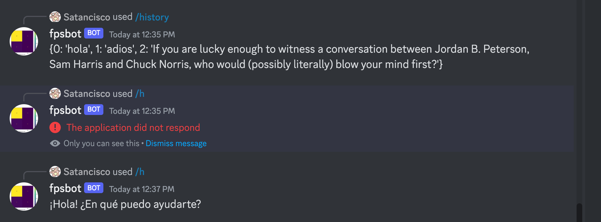
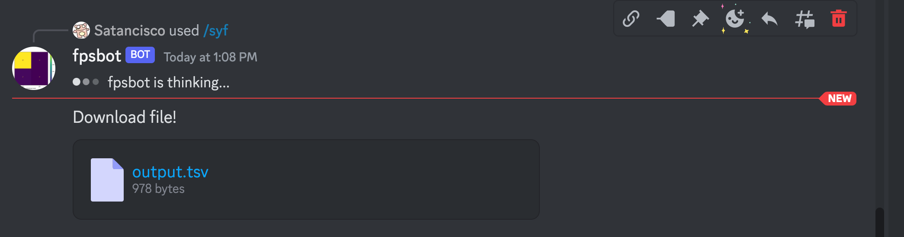
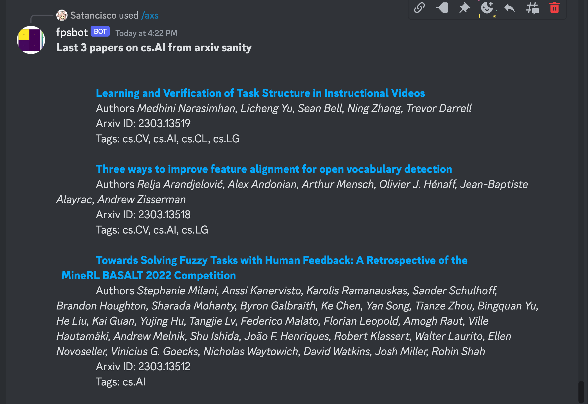
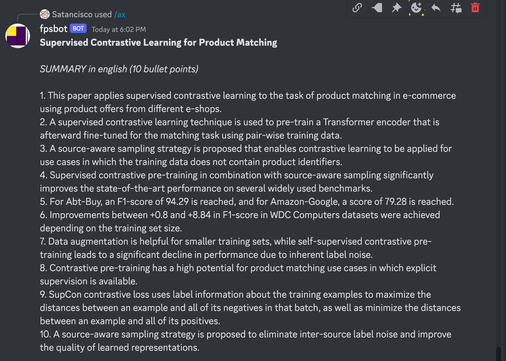
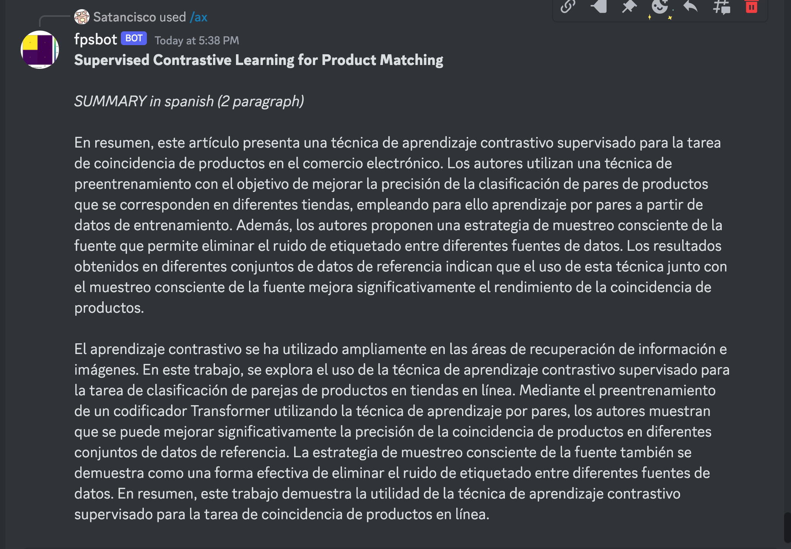

# TotonDelBoters

## Prerequisites

* Python - to run things
* pyenv/poetry - to ease/automate the cumbersome things in the previous point
* [discord account](https://discord.com/) - to chat with things and optionally ppl
* [discord developer account](https://discord.com/developers) - to depelop parrot-like things and, in the future, people you like more
* [open ai account](https://platform.openai.com/) - to empty your pocket
* will - to... whatever you want

## Install

Clone this repo
```sh
git clone git@github.com:francisco-perez-sorrosal/satnbot.git
```

Install project dependencies
```sh
cd satnbot
poetry install
```

## Dockerize

```sh
docker build -t "satnbot" .
docker run -it --rm -e DISCORD_TOKEN="MTA-xxx" -e OPENAI_API_KEY="sk-xxx" satnbot
```

## Discord Prerequisites

I'm assuming you have your fancy Discord account! 😃

1. Create your server where to chat with your bot
2. Create your application/bot in the [Discord Dev Portal](https://discord.com/developers)
3. Assign the right permissions to let your bot do things! 🥶

    3.1. In OAuth2's URL generator, select the scopes (e.g. `bot` and `application.command`)
    3.2 Then select the bot permissions (e.g. `administrator`)
4. Copy the generated url and invite your bot to your server!
5. In your server, add the permissions to the slash commands (see below) that the bot registers (Server Settings/Integrations) 🧐 (e.g. /syf)
5. Use it!

## Slack
See [TODOs](#todos) below

## Use It

Edit the `tdb.sh` and put your tokens/keys there:
```
DISCORD_TOKEN="<YOUR_DISCORD_APP_TOKEN_HERE>"
OPENAI_API_KEY="<YOUR_OPENAI_KEY_HERE>"
```

```sh
./tdb.sh
```

## NOTE

**Bear in mind when using the bot capabilities below that**:
* Input/Output to/from OpenAI's ChatGPT is limited to a certain number of tokens (depending on the model)
* Discord's bot Output is limited to 2000 chars.

Both limitations can be workaround but this is not done at this point. [Will be addressed later](https://github.com/francisco-perez-sorrosal/satnbot/issues)


## What/How to Use It?

### As a friend (poor's man option if you don't have many as is my case)

1. Introduce a prompt on your the discord channel of your server and add the name of your bot to it to trigger a request to ChatGPT. Example:

```discord
@fpsbot what should I do today apart from my daily learning duties reading about quantum physics, biomechatronics, synthetic biology and the wsj?
```



Yeah... I guess my life sucks...

There's also a slash command (`/history`) to check the history or requests...


...so you can ask again (with `/h <idx_no>`) to get another thrilling response..


### As a Stock Ticker extractor

You can use this thig also with the slash command `/syf` (syf: Stats Yahoo Finance) slash command to get a stats report of the tickers of the day from [Yahoo Finance](https://finance.yahoo.com/most-active?offset=0&count=100)

By default you get a human readable output...


...but if you send the command with the parameter `format` as tsv `/syf tsv` it will return a tsv-formatted file for you to digest wisefully with a High Speed ML trading algorithm to become rich some day ([Mental note: TODO ASAP](https://github.com/francisco-perez-sorrosal/satnbot/milestone/5)).



In summary, basically this does to do what this engineer/scientist (representing many of us) had to do very painfully [here](https://github.com/DeBeersN/Web-scraping-Yahoo-Finance-using-requests-and-Beautiful-Soup/blob/main/web-scraping-with-python-project.ipynb)

### As an arxiv helper!

**Important Note** When passing the text extracted from the pdf document to the bot with the `/ax` command input has to be limited when sending it to ChatGPT. This can be done with the parameters `chunks` and `chars_per_chunk` available in the slash command.

You can use the bot also with the slash command `/axs` (arxiv sanity) to access the latest articles in the topic you specify:

```discord
/axs filter_tags cs.AI
```

Or you can retrieve stuff on two+ different topics:
```discord
/axs filter_tags cs.AI&cs.CV
```



Then you can copy the Arxiv ID and then use the `/ax` (arxiv) slash command to retrieve a summary of the article:

```discord
/ax arxiv_id: 2202.02098
```

You can specify also the `language` (english is default) in which you want the summary and the `style` (paragraph(default)|bulletpoints|sonnet) and number of `style_items`

```discord
/ax arxiv_id: 2202.02098 language: english style: bulletpoints style_items: 10
```


```discord
/ax arxiv_id:2202.02098 language:spanish style:paragraph style_items:2
```


## TODOs

For things here to do before I grow old or before I die see [this](https://github.com/francisco-perez-sorrosal/satnbot/milestones).
