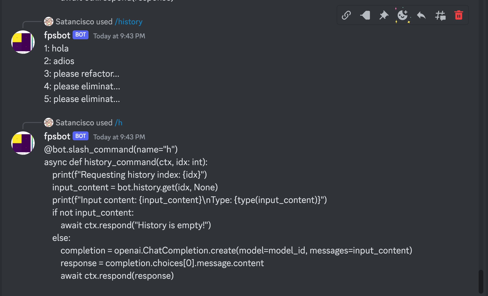

# TotonDelBoters

## Prerequisites

* Python - to run things
* pyenv/poetry - to ease/automate the cumbersome things in the previous point
* [discord account](https://discord.com/) - to chat with things and optionally ppl
* [discord developer account](https://discord.com/developers) - to depelop things and, in the future, people you like more
* [open ai account](https://platform.openai.com/) - to empty your pocket
* will - to... whatever you want

## Install

Clone this repo
```sh
git clone git@github.com:francisco-perez-sorrosal/satnbot.git
```

Install project dependencies
```sh
cd satnbot
poetry install
```

## Discord Prerequisites

I'm assuming you have your fancy Discord account! 😃

1. Create your server where to chat with your bot
2. Create your applicatoin/bot in the [Discord Dev Portal](https://discord.com/developers)
3. Assign the right permissions to let your bot do things! 🥶
4. Generate the url and invite your bot to your server!
5. In your server, add the permissions to the commands that the bot registers 🧐 (e.g. /syf)
5. Use it!

## Slack
See [TODOs](#todos) below

## Use It

Edit the `tdb.sh` and put your tokens/keys there:
```
DISCORD_TOKEN="<YOUR_DISCORD_APP_TOKEN_HERE>"
OPENAI_API_KEY="<YOUR_OPENAI_KEY_HERE>"
```

```sh
./tdb.sh
```

## What/How to Use It?

### As a friend (poor's man option if you don't have many as is my case)

1. Introduce a prompt on your the discord channel of your server and add the name of your bot to it to trigger a request to ChatGPT. Example:

```discord
@fpsbot what should I do today apart from my daily learning duties reading about quantum physics, biomechatronics, synthetic biology and the wsj?
```


Yeah... I guess my life sucks...

There's also a slash command (`/history`) to check the history or requests...


...so you can ask again (with `/h <idx_no>`) to get another thrilling response..

Although in this case literally blows because [there's a Heissenbug](https://github.com/francisco-perez-sorrosal/satnbot/issues/1) that I have to fix.

### As a Stock Ticker extractor

You can use this thig also with the slash command `/syf` (syf: Stats Yahoo Finance) slash command to get a stats report of the tickers of the day from [Yahoo Finance](https://finance.yahoo.com/most-active?offset=0&count=100)

By default you get a human readable output...


...but if you send the command with the parameter `format` as tsv `/syf tsv` it will return a tsv-formatted file for you to digest wisefully with a High Speed ML trading algorithm to become rich some day ([Mental note: TODO ASAP](https://github.com/francisco-perez-sorrosal/satnbot/milestone/5)).


In summary, basically this does to do what this poor guy (representing many of us) had to do very painfully [here](https://github.com/DeBeersN/Web-scraping-Yahoo-Finance-using-requests-and-Beautiful-Soup/blob/main/web-scraping-with-python-project.ipynb)

### As a...
More to come

## TODOs

For things here to do before I grow old or before I die see [this](https://github.com/francisco-perez-sorrosal/satnbot/milestones).

